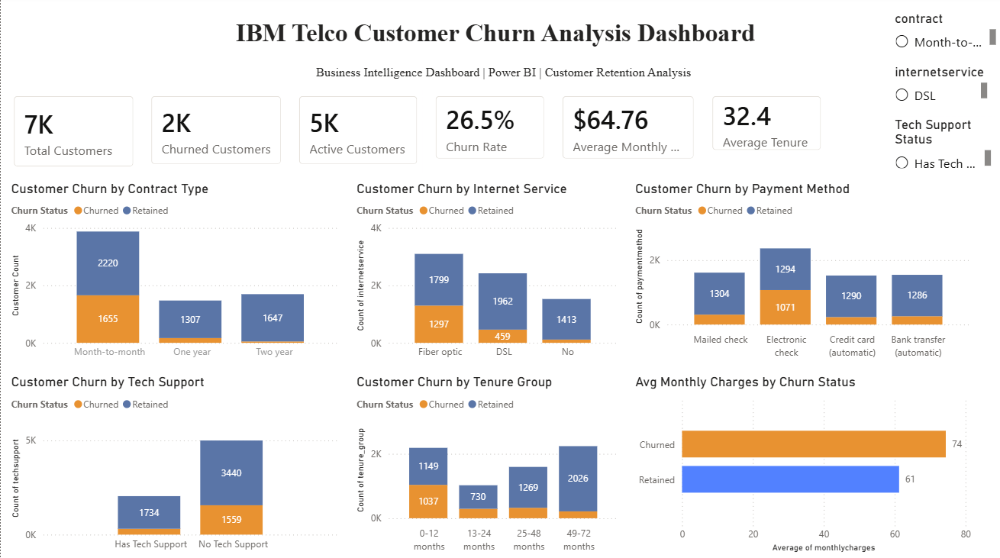

# IBM Telco Customer Churn Analysis

An end-to-end data analytics and business intelligence project examining customer churn across 7,043 telecommunications customers. The project combines **Excel, Python, Snowflake SQL, statistical hypothesis testing, and Power BI** to identify high-risk customer segments and translate analytical findings into practical retention recommendations.

## Dashboard Preview



**Power BI artifact:** [Open or download the `.pbix` report](powerbi/IBM_Telco_Customer_Churn.pbix)

## Results at a Glance

| Business area | Key finding |
|---|---:|
| Overall customer churn | **26.54%** |
| Month-to-month contract churn | **42.71%** |
| One-year contract churn | **11.27%** |
| Two-year contract churn | **2.83%** |
| First-year customer churn | **47.44%** |
| Fiber-optic customer churn | **41.89%** |
| Electronic-check customer churn | **45.29%** |
| Customers with no support services | **56.67% churn** |
| Customers with all four support services | **5.32% churn** |
| Highest-risk multi-factor segment | **81.61% churn** |

The strongest churn concentration appeared among customers combining **month-to-month contracts, short tenure, fiber-optic internet, electronic-check payments, and limited support-service adoption**.

> **Interpretation note:** These findings describe associations within this dataset. They do not establish that changing a contract, payment method, or service subscription will directly cause churn to decline. Proposed interventions should be validated through controlled testing.

---

## Business Problem

Customer churn reduces recurring revenue and increases pressure on customer-acquisition spending. The business needs to understand:

1. Which customer groups experience the highest churn?
2. How do contract type, tenure, internet service, payment method, pricing, and support-service adoption relate to retention?
3. Which segments should receive the highest priority for retention outreach?
4. How can analytical findings be communicated through executive-ready reporting?

---

## Project Objectives

- Assess and document data quality before analysis.
- Clean and transform the raw customer dataset with Python.
- Explore churn patterns across customer, service, contract, and billing attributes.
- Use Snowflake SQL to create reusable analytical logic, KPIs, and dashboard views.
- Validate major relationships with statistical hypothesis tests and effect sizes.
- Build an interactive Power BI dashboard for business stakeholders.
- Translate the findings into prioritized retention recommendations.

---

## Analytics Workflow

```text
IBM Telco Customer Churn CSV
            |
            v
Excel Data Quality Assessment
            |
            v
Python Cleaning and Feature Engineering
            |
            v
Cleaned CSV Export
            |
            v
Manual Upload to Snowflake through Snowsight
            |
            v
Snowflake Validation, Transformations, KPIs, and Reporting Views
            |
            v
Statistical Hypothesis Testing
            |
            v
Power BI Dashboard
            |
            v
Executive Summary and Business Recommendations
```

### Snowflake ingestion approach

The raw dataset was cleaned in Python and exported as:

```text
data/processed/telco_churn_clean.csv
```

That cleaned CSV was then uploaded manually into Snowflake through the **Snowsight data-loading interface**. The SQL scripts assume the cleaned customer table has been loaded and then perform validation, transformations, business analysis, KPI calculation, and dashboard-view creation.

This manual ingestion method was selected to demonstrate a realistic analyst workflow. It is not intended to represent an automated production ingestion pipeline.

---

## Repository Structure

```text
.
├── README.md
├── requirements.txt
│
├── data
│   ├── raw
│   │   └── WA_Fn-UseC_-Telco-Customer-Churn.csv
│   ├── processed
│   │   └── telco_churn_clean.csv
│   └── sql_exports
│
├── docs
│   ├── analytical_methodology.md
│   ├── business_case.md
│   ├── business_recommendations.md
│   ├── data_quality_report.md
│   └── statistical_analysis.md
│
├── excel
│   └── telco_churn_raw.xlsx
│
├── notebooks
│   ├── 02_data_cleaning.ipynb
│   ├── 03_exploratory_data_analysis.ipynb
│   └── 04_statistical_analysis.ipynb
│
├── powerbi
│   ├── IBM_Telco_Customer_Churn.pbix
│   └── screenshots
│       └── dashboard-overview.png
│
├── reports
│   ├── executive_summary.md
│   └── final_report.md
│
└── sql
    ├── 01_schema.sql
    ├── 02_load_data.sql
    ├── 03_data_validation.sql
    ├── 04_transformations.sql
    ├── 05_business_queries.sql
    ├── 06_kpi_queries.sql
    └── 07_dashboard_views.sql
```

---

## Dataset

| Attribute | Value |
|---|---:|
| Records | 7,043 |
| Original features | 21 |
| Industry | Telecommunications |
| Analytical grain | One row per customer |
| Target variable | Churn |
| Target values | Yes / No |

The dataset includes customer demographics, subscribed services, contract details, billing preferences, tenure, monthly charges, total charges, and churn status.

---

## Analytical Approach

### 1. Data quality assessment

The raw data was reviewed in Excel and Python for:

- Missing and blank values
- Duplicate customer records
- Incorrect data types
- Invalid or inconsistent categories
- Formatting problems
- Numeric range and logical consistency issues

See the [data quality report](docs/data_quality_report.md).

### 2. Python cleaning and feature engineering

Python and pandas were used to:

- Convert `TotalCharges` into a valid numeric field
- Handle blank values
- Validate customer identifiers
- Standardize analytical data types
- Encode binary service and churn variables
- Create customer tenure groups
- Create charge bands and analytical categories
- Export the cleaned dataset for Snowflake

Review the [data-cleaning notebook](notebooks/02_data_cleaning.ipynb).

### 3. Exploratory data analysis

EDA examined churn across:

- Contract type
- Customer tenure
- Internet service
- Technical support
- Online security and other support services
- Payment method
- Paperless billing
- Monthly charges
- Demographic and household attributes
- Multi-factor customer segments

Review the [EDA notebook](notebooks/03_exploratory_data_analysis.ipynb).

### 4. Snowflake SQL analytics

Snowflake was used to demonstrate a cloud-based analytical workflow involving:

- Warehouse, database, and schema configuration
- Post-load data validation
- Reusable analytical transformations
- Business-question queries
- Executive KPI calculations
- Dashboard-ready reporting views
- Multi-factor churn segmentation

Review the [`sql` directory](sql/).

### 5. Statistical validation

Major exploratory findings were evaluated with:

- Chi-square tests of independence
- Mann–Whitney U tests
- Assumption checks
- Effect-size measures
- Practical interpretation of statistical results

Statistical significance was treated as evidence of association, not causation.

Review the [statistical-analysis notebook](notebooks/04_statistical_analysis.ipynb) and [statistical report](docs/statistical_analysis.md).

### 6. Power BI reporting

The dashboard presents:

- Total, churned, and retained customers
- Overall churn rate
- Average monthly charges
- Average tenure
- Churn by contract type
- Churn by internet service
- Churn by payment method
- Churn by technical-support status
- Churn by tenure group
- Monthly-charge comparisons
- Interactive business filters

Open the [Power BI report](powerbi/IBM_Telco_Customer_Churn.pbix).

---

## Key Business Findings

### Contract commitment

Month-to-month customers had a **42.71% churn rate**, compared with **11.27%** for one-year contracts and **2.83%** for two-year contracts. Contract type was one of the clearest indicators of retention differences.

### Early customer lifecycle

Customers in their first 12 months had a **47.44% churn rate**. Churn declined as customer tenure increased, making early-lifecycle engagement a high-priority business opportunity.

### Internet service

Fiber-optic customers had a **41.89% churn rate**, substantially higher than customers using DSL. This result warrants further investigation into service reliability, pricing, customer expectations, and perceived value.

### Payment behavior

Electronic-check customers had the highest payment-method churn rate at **45.29%**. Automatic payment groups had materially lower observed churn.

### Support-service adoption

Among internet-service customers, churn fell as adoption of online security, online backup, device protection, and technical support increased:

| Number of support services | Churn rate |
|---:|---:|
| 0 | **56.67%** |
| 1 | **38.85%** |
| 2 | **23.76%** |
| 3 | **12.43%** |
| 4 | **5.32%** |

This is one of the project’s strongest business findings, although service adoption may also reflect customer engagement and other underlying differences.

### Multi-factor risk

The highest-risk combinations involved month-to-month customers with short tenure, fiber-optic service, and selected payment methods. Segments containing at least 50 customers reached churn rates above 70%, with the highest observed segment reaching **81.61%**.

---

## Prioritized Business Recommendations

### 1. Strengthen first-year onboarding and engagement

Create structured outreach at key early-lifecycle points, such as 30, 90, 180, and 270 days. Track service issues, support contacts, and customer satisfaction during the period where churn is highest.

### 2. Test long-term contract incentives

Target eligible month-to-month customers with carefully designed loyalty offers, service bundles, or price guarantees. Measure whether the offer increases contract conversion and reduces churn relative to a control group.

### 3. Investigate fiber-optic customer experience

Analyze complaints, outages, service tickets, pricing, speed expectations, and regional service quality before assuming that fiber service itself causes churn.

### 4. Test support-service bundles

Offer relevant support and protection packages to high-risk internet customers, particularly those with no current support services. Evaluate adoption, incremental cost, satisfaction, and retention impact.

### 5. Evaluate payment-method interventions

Test incentives that make automatic payment easier or more attractive for electronic-check customers. Monitor conversion, payment failures, customer complaints, and churn.

### 6. Prioritize multi-factor segments

Use combined risk attributes rather than one-variable rules. Retention teams should prioritize segments based on:

- Churn rate
- Number of customers
- Monthly charge exposure
- Customer tenure
- Expected intervention cost
- Measured campaign response

---

## Business and Analytical Limitations

- The dataset is a static customer snapshot and does not include churn dates.
- Monthly charges represent **charge exposure**, not verified lost revenue.
- The analysis identifies associations and cannot establish causal effects.
- The dataset does not contain customer satisfaction, service outage, complaint, or competitor-pricing data.
- Results from this sample should not automatically be generalized to every telecommunications company.
- Recommended interventions require controlled testing before organization-wide implementation.

---

## Tools and Technologies

| Area | Tools |
|---|---|
| Data quality and review | Microsoft Excel |
| Programming and analysis | Python, pandas, NumPy |
| Statistics | SciPy |
| Visualization | Matplotlib, Seaborn |
| Cloud data warehouse | Snowflake |
| Business intelligence | Microsoft Power BI |
| Development environment | Jupyter Notebook |
| Version control | Git, GitHub |

---

## Documentation and Deliverables

### Analysis documentation

- [Analytical methodology](docs/analytical_methodology.md)
- [Business case](docs/business_case.md)
- [Data quality report](docs/data_quality_report.md)
- [Statistical analysis](docs/statistical_analysis.md)
- [Business recommendations](docs/business_recommendations.md)

### Business reports

- [Executive summary](reports/executive_summary.md)
- [Final report](reports/final_report.md)

### Main technical artifacts

- [Data-cleaning notebook](notebooks/02_data_cleaning.ipynb)
- [Exploratory-analysis notebook](notebooks/03_exploratory_data_analysis.ipynb)
- [Statistical-analysis notebook](notebooks/04_statistical_analysis.ipynb)
- [Snowflake SQL workflow](sql/)
- [Power BI dashboard](powerbi/IBM_Telco_Customer_Churn.pbix)

---

## Running the Project

### 1. Clone the repository

```bash
git clone https://github.com/Mustak-Eman/telco-customer-churn-analysis.git
cd telco-customer-churn-analysis
```

### 2. Create and activate a virtual environment

#### Windows PowerShell

```powershell
python -m venv .venv
.venv\Scripts\Activate.ps1
```

#### macOS or Linux

```bash
python3 -m venv .venv
source .venv/bin/activate
```

### 3. Install Python dependencies

```bash
python -m pip install --upgrade pip
pip install -r requirements.txt
```

### 4. Launch Jupyter

```bash
jupyter notebook
```

Run the notebooks in this order:

1. [`02_data_cleaning.ipynb`](notebooks/02_data_cleaning.ipynb)
2. [`03_exploratory_data_analysis.ipynb`](notebooks/03_exploratory_data_analysis.ipynb)
3. [`04_statistical_analysis.ipynb`](notebooks/04_statistical_analysis.ipynb)

### 5. Load the cleaned CSV into Snowflake

After running the cleaning notebook:

1. Confirm that `data/processed/telco_churn_clean.csv` was created.
2. Open Snowflake Snowsight.
3. Create or select the project database and schema.
4. Upload the cleaned CSV using the Snowsight data-loading interface.
5. Confirm the destination table and inferred data types.
6. Run the validation query in `sql/02_load_data.sql`.

> The current project uses manual Snowsight ingestion. It does not include an automated stage or `COPY INTO` pipeline.

### 6. Execute the Snowflake SQL scripts

Run the scripts in numerical order:

1. [`01_schema.sql`](sql/01_schema.sql)
2. [`02_load_data.sql`](sql/02_load_data.sql)
3. [`03_data_validation.sql`](sql/03_data_validation.sql)
4. [`04_transformations.sql`](sql/04_transformations.sql)
5. [`05_business_queries.sql`](sql/05_business_queries.sql)
6. [`06_kpi_queries.sql`](sql/06_kpi_queries.sql)
7. [`07_dashboard_views.sql`](sql/07_dashboard_views.sql)

### 7. Open the Power BI dashboard

Open:

```text
powerbi/IBM_Telco_Customer_Churn.pbix
```

A local Snowflake connection may require the reviewer to provide their own Snowflake credentials and update the Power BI data-source settings.

---

## Portfolio Skills Demonstrated

- End-to-end analytics workflow design
- Data-quality assessment and preprocessing
- Python and pandas data transformation
- Exploratory and statistical analysis
- Snowflake SQL and cloud-warehouse reporting
- KPI definition and business segmentation
- Power BI dashboard development
- Executive reporting and business communication
- Analytical limitations and responsible interpretation
- Git and GitHub project organization

---

## Author

**Mustak Eman**  
Computer Science Student | Data Analytics | Business Intelligence | AI & Machine Learning

- [GitHub](https://github.com/Mustak-Eman)
- [LinkedIn](https://www.linkedin.com/in/mustak-eman-6517b2198)

---

## License and Dataset Use

This repository was created for educational and professional portfolio purposes. The IBM Telco Customer Churn dataset is included for analysis and demonstration. Review the original dataset source and applicable usage terms before reusing or redistributing it.
